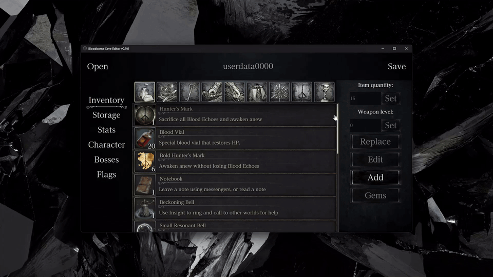
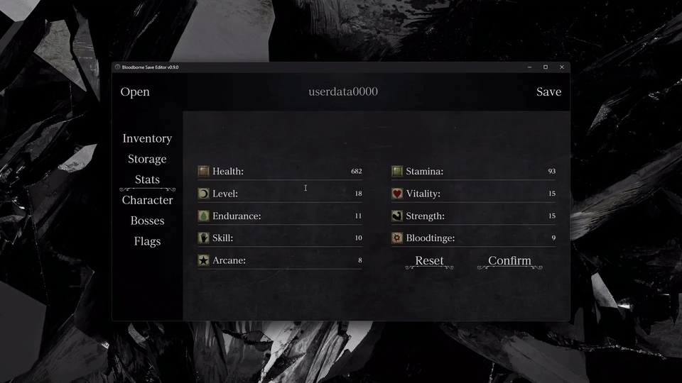
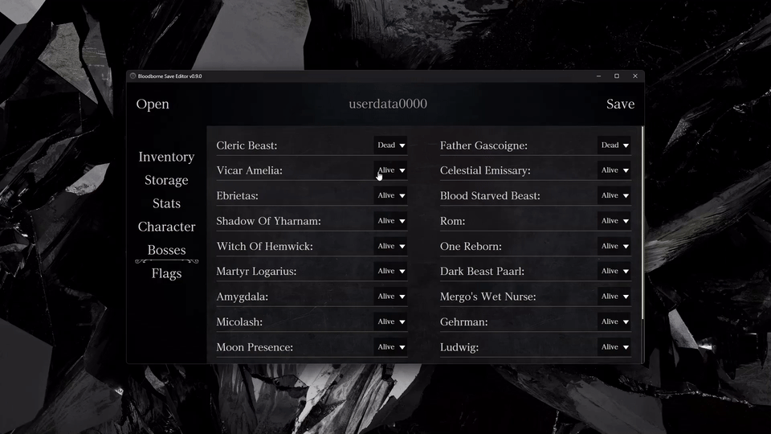

<div align=center> 
  
  <p><p/>


[](https://coveralls.io/github/Noxde/Bloodborne-save-editor)

<div><a href='https://ko-fi.com/R5R8106WUY' target='_blank'></a>
</div>

</div>
<h1 align="center">Bloodborne Save Editor</h1>

<p align="center">
   <b>DISCLAIMER:</b> We do not condone the use of this software for cheating or griefing in online games by any means.
</p>

<div align="center">


</div>

> [!IMPORTANT] > **To use this save editor on Playstation you first need to decrypt your bloodborne save, check out the [wiki](https://github.com/Noxde/Bloodborne-save-editor/wiki/How-to-decrypt-a-save) if you don't know how.**

> [!NOTE]
> If you want to use this with shadPS4, saves are located in `shadPS4/user/savedata/1/GAMEID/SPRJ0005/`
> shadPS4 being the folder where the executable is located
> The id for Bloodborne can be one of the following depending on your version of the game:
>
> - CUSA00900
> - CUSA03173
> - CUSA00207
> - CUSA01363

## Table of Contents

- [1. Features](#1-features)
- [2. Download](#2-download)
- [3. Build from source](#3-build-from-source)
- [4. Attributions](#4-attributions)
- [5. License](#5-license)

## 1. Features

- Automatic backup when opening a file.
- Item filters to easily find whatever you need.
- <details>
      <summary>
         Change items amount.
      </summary>

   
   </details>

- <details>
      <summary>
         Transform items, weapons or armors into different ones including cut content.
      </summary>

   
   </details>

- <details>
      <summary>
         Modify character attributes.
      </summary>

   
   </details>

- <details>
      <summary>
         Modify Blood echoes, insight, gender, origin, voice and position.
      </summary>

   
   </details>

- <details>
      <summary>
        Edit Gems and Runes
      </summary>

   
   </details>

- <details>
      <summary>
        Add items
      </summary>

   
   </details>

- <details>
      <summary>
        Edit weapons and armor gem slots
      </summary>

   
   </details>

- <details>
      <summary>
        Kill and revive bosses
      </summary>

   
   </details>

## 2. Download

You can download the pre-built executable for your operating system from the [Releases](https://github.com/Noxde/Bloodborne-save-editor/releases) section.

If you encounter any bug please [make an issue](https://github.com/Noxde/Bloodborne-save-editor/issues/new)

### Video tutorial on how to use the editor on Playstation

[](https://www.youtube.com/watch?v=vP8p_osK8sw)  
<sub>click the image to go to the video</sub>

Thanks to [Ricky Zaragoza](https://www.youtube.com/@ricardozaragoza3812) for making this video, this video is focused on the full process for playstation but if you only want to see the save editor working, it's useful too.

## 3. Build from source

1. Make sure to have [Rust](https://www.rust-lang.org/) and [NodeJS](https://nodejs.org/en) installed.
2. Install the [Tauri dependencies](https://tauri.app/v1/guides/getting-started/prerequisites) for your operating system.
3. Clone the repo:

   ```bash
   $ git clone https://github.com/Noxde/Bloodborne-save-editor
   ```

4. Navigate to the project directory:

   ```bash
   $ cd Bloodborne-save-editor
   ```

5. Install the dependencies
   ```bash
   $ npm install
   ```
   If you want to run the dev version with hot reloading run `$ npm run dev` or if you want to build it run `$ npm run tauri build`

The release will be located in `Bloodborne-save-editor/src-tauri/target/release/`

## 4. Attributions

Big thanks to Meph for making the [Bloodborne Wiki](https://www.bloodborne-wiki.com/). Weapon stats, game assets and inspiration for the UI come from here.

Thanks to @foxyhooligan on discord for helping with gem effects ids, how to edit the new game plus level, other flags and more.

Thanks to [PlayingUnfairly](https://www.youtube.com/@PlayingUnfairly) for the detailed tutorials on how to edit character stats, gems/runes, weapons/armors and appearance.

Thanks to @xtrin on the "The Tomb Prospectors" discord for explaining to me how gem images work based on their effects and level.

## 5. License

This project is licensed under the [GPL-3.0 License](./LICENSE).
