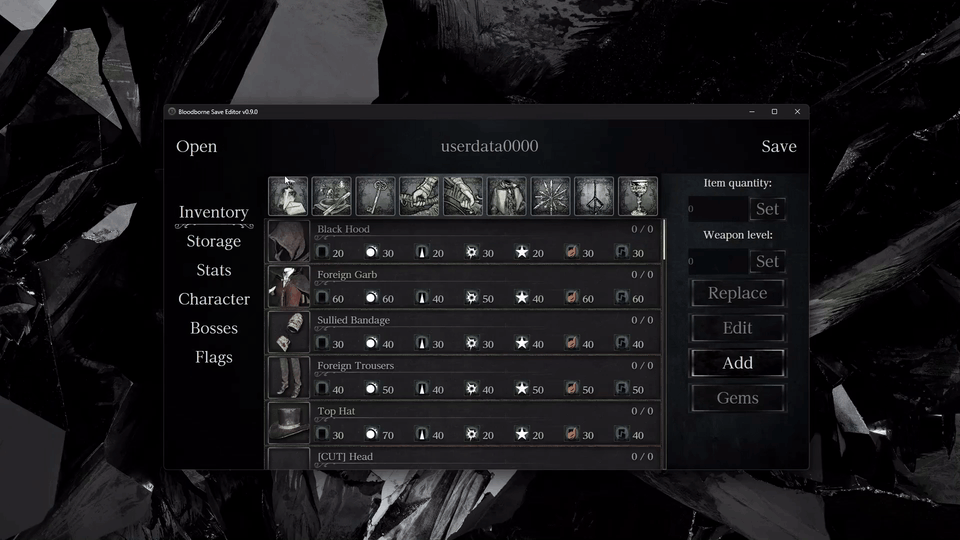
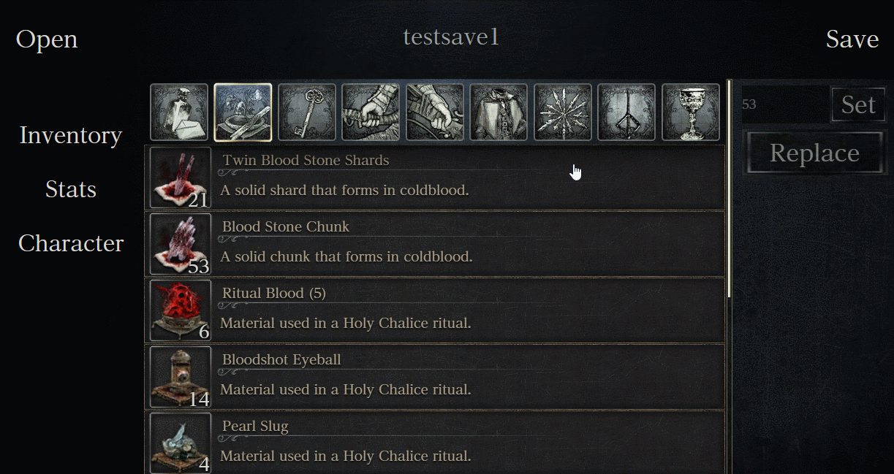
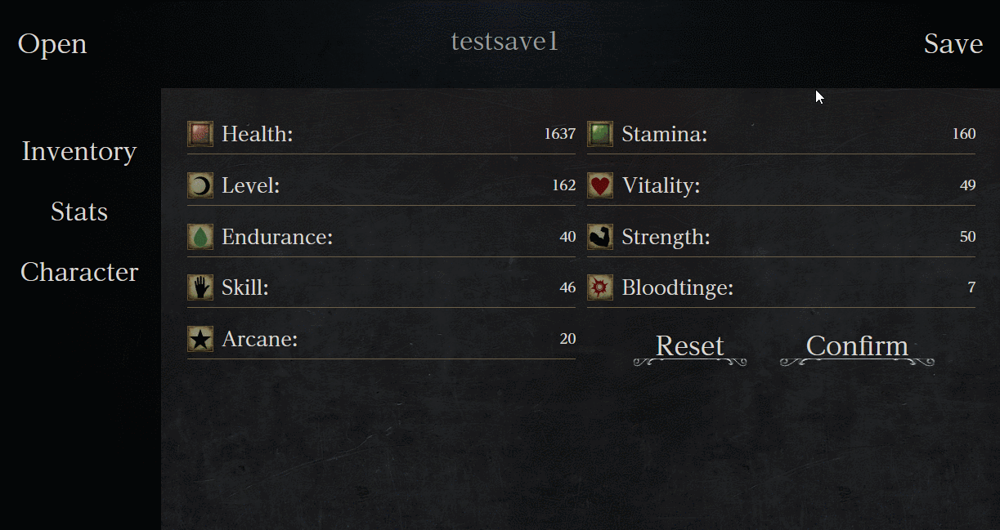
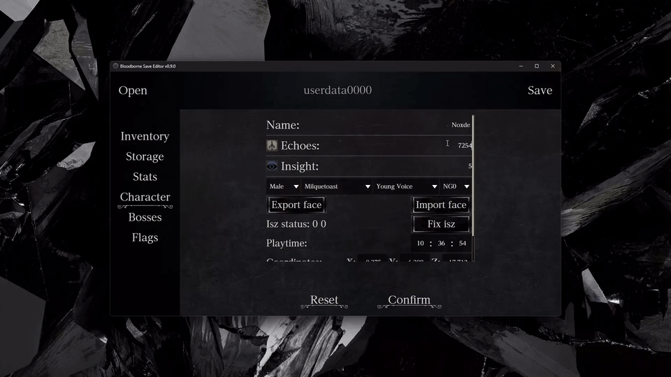
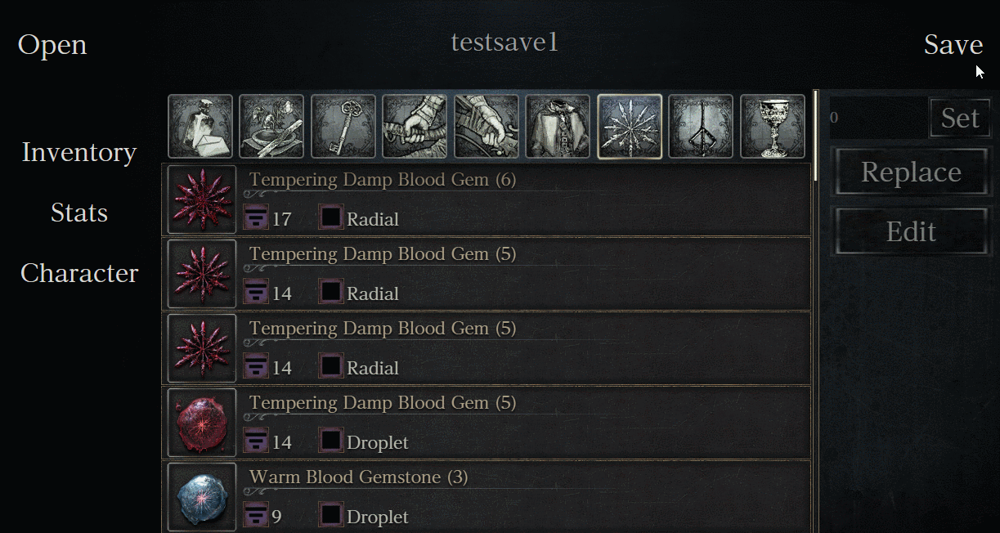
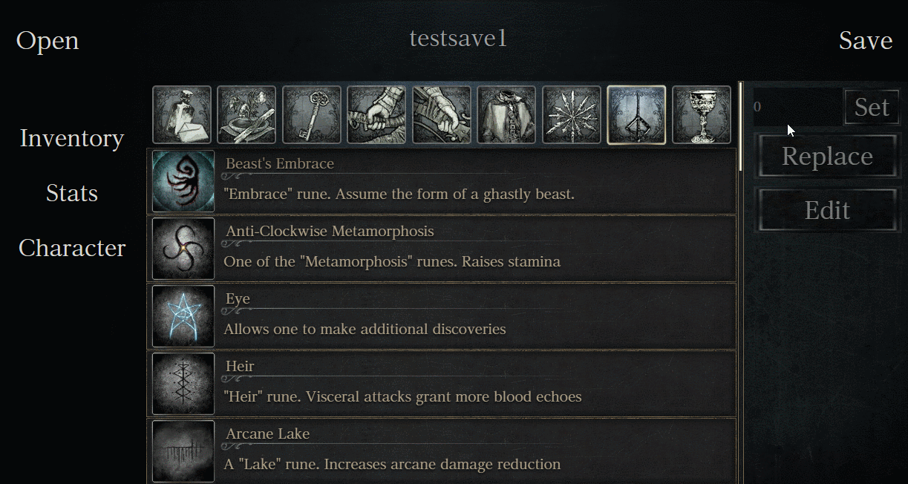

<div align=center> 
  
  <p><p/>


[](https://coveralls.io/github/Noxde/Bloodborne-save-editor)
</div>
<h1 align="center">Bloodborne Save Editor</h1>

<p align="center">
   <b>DISCLAIMER:</b> We do not condone the use of this software for cheating or griefing in online games by any means.
</p>

<div align="center">



</div>

**Note:** To use this save editor you first need to decrypt your bloodborne save. 

If you want to use this with shadPS4, saves are located in ``shadPS4/user/savedata/1/GAMEID``
shadPS4 being the folder where the executable is located

The id for Bloodborne can be one of the following:
- CUSA00900
- CUSA03173
- CUSA00207
- CUSA01363

## Table of Contents

- [1. Features](#1-features)
- [2. Build from source](#2-build-from-source)
- [3. Download](#3-download)
- [4. Attributions](#4-attributions)
- [5. License](#5-license)

## 1. Features

- Automatic backup when opening a file.
- Item filters to easily find whatever you need.
- <details>
      <summary>
         Change items amount.
      </summary>

   
   </details>

- <details>
      <summary>
         Transform items, weapons or armors into different ones including cut content.
      </summary>

   
   </details>

- <details>
      <summary>
         Modify character attributes.
      </summary>

   
   </details>

- <details>
      <summary>
         Modify Blood echoes, insight, gender, origin and voice.
      </summary>

   
   </details>
   
- <details>
      <summary>
        Edit Gems
      </summary>

   
   </details>

- <details>
      <summary>
        Edit Runes
      </summary>

   
   </details>

## 2. Build from source

1. Make sure to have [Rust](https://www.rust-lang.org/) and [NodeJS](https://nodejs.org/en) installed.
2. Install the [Tauri dependencies](https://tauri.app/v1/guides/getting-started/prerequisites) for your operating system.
3. Clone the repo:

   ```bash
   $ git clone https://github.com/Noxde/Bloodborne-save-editor
   ```
4. Navigate to the project directory:

   ```bash
   $ cd Bloodborne-save-editor
   ```
5. Install the dependencies
   ```bash
   $ npm install
   ```
If you want to run the dev version with hot reloading run ``$ npm run dev`` or if you want to build it run ``$ npm run tauri build``

The release will be located in ``Bloodborne-save-editor/src-tauri/target/release/``

## 3. Download

You can download the pre-built executable for your operating system from the [Releases](https://github.com/Noxde/Bloodborne-save-editor/releases) section.
For Windows, download the .exe, and for Linux, download the .AppImage.

Currently there is no Mac build.

If you encounter any bug please [make an issue](https://github.com/Noxde/Bloodborne-save-editor/issues/new)

## 4. Attributions

Big thanks to Meph for making the [Bloodborne Wiki](https://www.bloodborne-wiki.com/). All the information used on this project comes from there.

## 5. License

This project is licensed under the [GPL-3.0 License](./LICENSE).
